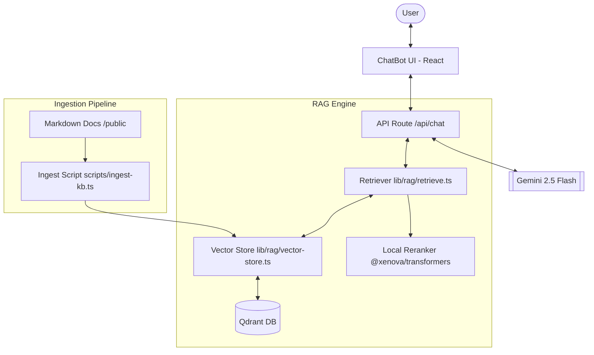

# AI Story Advisor: Technical Documentation

The AI Story Advisor is a sophisticated Retrieval-Augmented Generation (RAG) system integrated into Yassine's portfolio. It acts as a digital twin (clone) of Yassine, capable of answering questions about his skills, projects, and professional background with high accuracy and a personal touch.

## 🏗️ Architecture Overview

The system is built on a modern AI stack designed for performance, accuracy, and low latency.

### Tech Stack
- **LLM**: Google Gemini 2.5 Flash (via Vercel AI SDK)
- **Embeddings**: Google Text Embedding 004
- **Vector Database**: Qdrant (Hybrid Search: Dense + Sparse vectors)
- **Reranker**: Xenova/ms-marco-TinyBERT-L-2-v2 (Local execution via `@xenova/transformers`)
- **Frontend**: Next.js 15, Framer Motion, Tailwind CSS
- **Backend**: Next.js Route Handlers (Edge-compatible)

### System Components

## 🚀 Core Features

- **Personalized Clone**: The AI speaks in the first person as Yassine, utilizing a specialized system prompt.
- **Hybrid Search**: Combines semantic (dense) search with keyword (sparse) search for superior retrieval quality.
- **Local Reranking**: Uses a cross-encoder model to sort retrieved chunks, ensuring the most relevant context is sent to the LLM.
- **Premium UI**: 
  - Floating interface with spring animations.
  - Markdown support with syntax highlighting.
  - Real-time typing indicators ("Yassine is typing...").
  - **Suggested Prompts**: Interactive chips for quick guided interaction.
- **Analytics Tracking**: Deep insights into user engagement and geolocation via a secure dashboard.
- **Paginated Management**: High-performance interfaces for browsing knowledge base content and visit logs.

## 📂 Documentation Directory

1. [RAG Flows](file:///home/dev/projects/cv/docs/RAG_FLOWS.md) - Detailed explanation of data movement.
2. [Use Cases](file:///home/dev/projects/cv/docs/USE_CASES.md) - Practical examples and interaction patterns.
3. [Architecture Deep Dive](file:///home/dev/projects/cv/docs/rag-system.md) - Legacy system overview (updated).
4. [Conceptual Background](file:///home/dev/projects/cv/docs/rag-concepts.md) - Why we use Hybrid search and Reranking.
5. [Admin Dashboard](file:///home/dev/projects/cv/docs/ADMIN_DASHBOARD.md) - How to manage the knowledge base.
