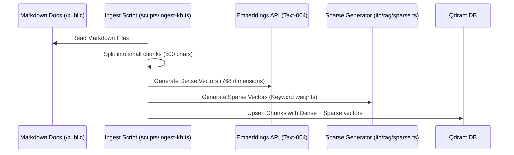
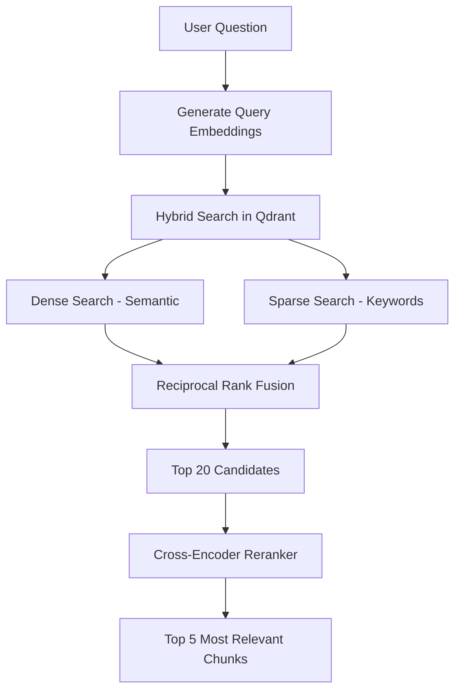
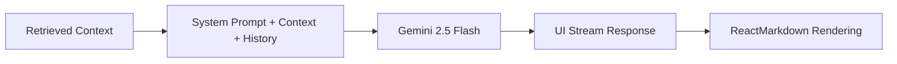

# AI Story Advisor: RAG Data Flows

This document details the internal processes that power the AI's ability to retrieve information and generate high-quality responses.

## 1. Knowledge Ingestion Flow
This flow occurs during development or when the knowledge base is updated. It prepares the data for efficient searching.

### Key Stages:
- **Chunking**: Large documents are broken into smaller, overlapping segments to preserve context and ensure the LLM receives focused information.
- **Sparse Generation**: Uses a custom keyword-weighting algorithm to ensure technical terms (like "PostgreSQL" or "Next.js") are matched exactly when searched.

## 2. Retrieval Flow (Dynamic)
This happens every time a user sends a message.

### Advanced Techniques:
- **Reciprocal Rank Fusion (RRF)**: A scoring system that combines results from two different search methods fairly.
- **Cross-Encoder Reranking**: Unlike a vector search (which measures distance), the reranker "reads" both the question and the chunk together to determine the true relevance, significantly reducing hallucinations.

## 3. Generation Flow (AI Response)
The final stage where the LLM constructs a response using the retrieved context.

### System Prompt Strategy:
The LLM is prompted to act as a **clone of Yassine**. It is instructed to:
1. Speak in the first person.
2. Use the provided context exclusively.
3. Admit when information is not in the context (politely).
4. Maintain a professional yet friendly personality.
