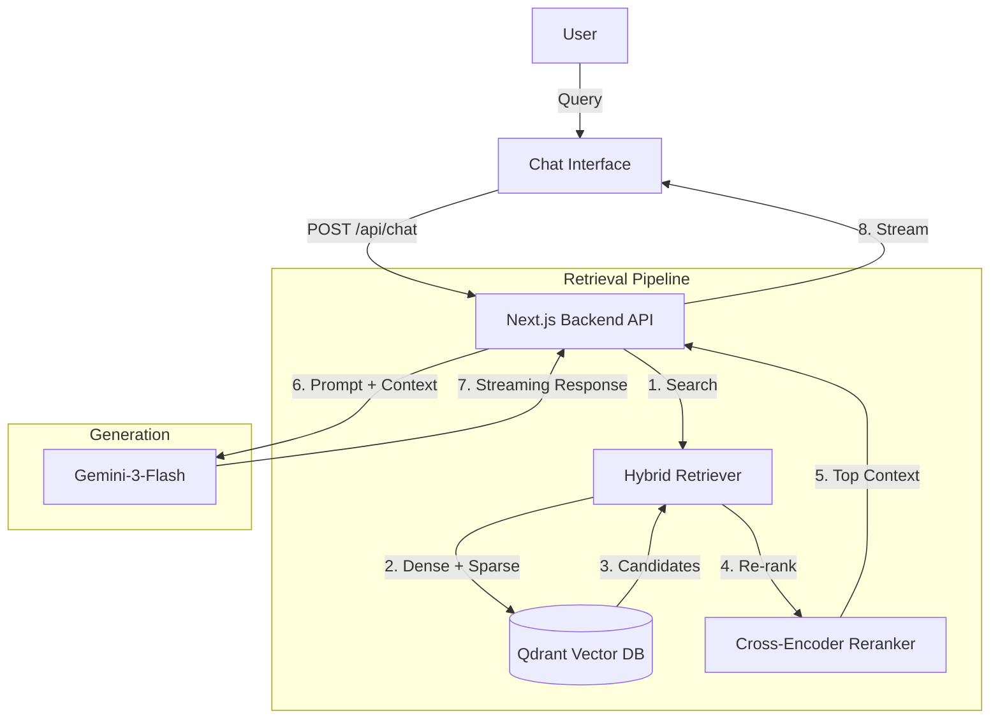

# RAG System Architecture

This document outlines the architecture for the Retrieval-Augmented Generation (RAG) system seamlessly integrated into the Next.js application.

## System Overview

The system allows users to chat with the application based on a custom knowledge base (Markdown/documents). It uses a **local Qdrant** vector database for storage and the **Google Gemini API** (`gemini-3-flash-preview`) for generation.

### Architecture Diagram



---

## Tech Stack

- **Framework**: Next.js 16
- **AI SDK**: Vercel AI SDK (`ai`, `@ai-sdk/google`)
- **LLM**: Google `gemini-3-flash-preview`
- **Vector DB**: Qdrant (Dockerized)
- **Embeddings**: `nomic-embed-text` or `text-embedding-3-small` (via AI SDK)

---

## Component Breakdown

### 1. Ingestion Engine
**Goal**: Convert raw documents into searchable chunks.
- **Path**: `lib/rag/ingest.ts` (Proposed)
- **Process**:
    1.  Read Markdown/PDF files.
    2.  Split into chunks (e.g., 500 tokens with overlap).
    3.  Generate Embeddings (Vectors).
    4.  Upsert to Qdrant.

### 2. Vector Store (Qdrant)
**Goal**: fast storage and retrieval.
- **Location**: Running locally via Docker.
- **Collection Name**: `knowledge-base`
- **Payload**: Stores metadata (filename, page number) alongside vectors.

### 3. Retriever (The Brain)
**Path**: `lib/rag/retriever.ts`
- Implements **Hybrid Search**:
    - Queries Qdrant for both semantic distance and keyword matches.
- Implements **Reranking**:
    - Uses a **local Cross-Encoder** via `@xenova/transformers` (e.g., `Xenova/ms-marco-TinyBERT-L-2-v2` or `Xenova/bge-reranker-base`).
    - Runs entirely on the server (no external API required) to re-order results.

### 4. Generator (Chatbot)
**Path**: `app/api/chat/route.ts`
- Uses `streamText` from Vercel AI SDK.
- Constructs a prompt injecting the **retrieved context** dynamically.

---

## Modularity & Maintenance

To ensure the system is easy to allow swapping parts:

1.  **Interfaces**: We define strict interfaces.
    ```typescript
    interface VectorStore {
      search(query: string): Promise<Document[]>;
      add(documents: Document[]): Promise<void>;
    }
    ```
2.  **Configuration**:
    - All model names, API keys, and prompt templates should be in `lib/rag/config.ts`, not hardcoded in logic files.

---

## Integration Steps

1.  **Start Qdrant**:
    Run `docker-compose up -d` (see root `docker-compose.yml`).


2.  **Environment Variables**:
    Copy `.env.example` to a new file named `.env`:
    ```bash
    cp .env.example .env
    ```
    Then update the values in `.env`:
    ```bash
    GOOGLE_GENERATIVE_AI_API_KEY=your_gemini_api_key_here
    QDRANT_URL=http://localhost:6333
    ```


3.  **Install Dependencies**:
    ```bash
    npm install ai @ai-sdk/google @qdrant/js-client-rest @xenova/transformers
    ```

4.  **Ingest Content**:
    (Script to be implemented) Run the ingestion script to populate the DB.

5.  **Start Chatting**:
    The chatbot endpoint will now utilize the `retrieveContext` function before calling Gemini.
