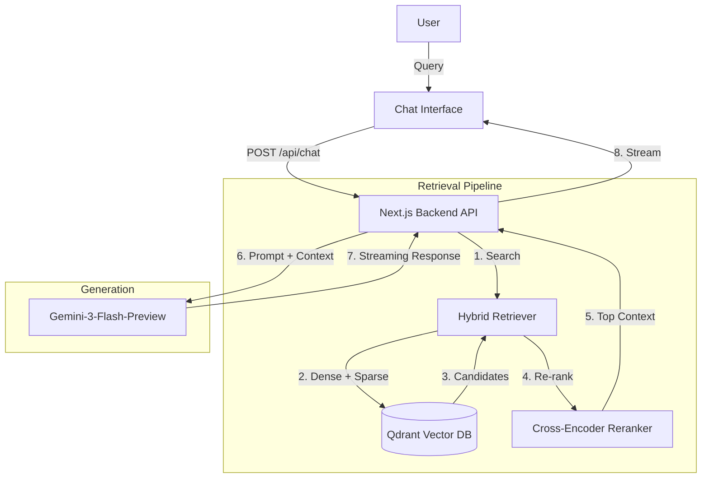

# RAG System Architecture

This document outlines the architecture for the Retrieval-Augmented Generation (RAG) system seamlessly integrated into the Next.js application.

## System Overview

The system allows users to chat with the application based on a custom knowledge base (Markdown/documents). It uses a **local Qdrant** vector database for storage and the **Google Gemini API** (`gemini-3-flash-preview`) for generation.

### Architecture Diagram



---

## Tech Stack

- **Framework**: Next.js 16
- **AI SDK**: Vercel AI SDK (`ai`, `@ai-sdk/google`)
- **LLM**: Google `gemini-3-flash-preview`
- **Vector DB**: Qdrant (Dockerized)
- **Embeddings**: Google `text-embedding-004` (via AI SDK)
- **Local Reranker**: `@xenova/transformers` (TinyBERT)

---

## Component Breakdown

### 1. Ingestion Engine
**Goal**: Convert raw documents into searchable chunks.
- **Library Path**: `app/lib/rag/ingest.ts`
- **Script Path**: `app/scripts/ingest-kb.ts`
- **Process**:
    1.  Read Markdown files from `app/public/`.
    2.  Split into chunks (500 characters with 50 overlap).
    3.  Generate Dense Embeddings (`text-embedding-004`).
    4.  Generate Sparse Vectors (Hash-based, see `lib/rag/sparse.ts`).
    5.  Upsert to Qdrant collection `knowledge-base`.

### 2. Vector Store (Qdrant)
**Goal**: fast storage and retrieval.
- **Location**: Running locally via Docker.
- **Collection Name**: `knowledge-base`
- **Logic**: `lib/rag/vector-store.ts`
- **Configuration**: Supports both dense and sparse vectors in the same collection.

### 3. Retriever (The Brain)
**Path**: `app/lib/rag/retrieve.ts`
- Implements **Hybrid Search**:
    - Queries Qdrant for both semantic distance (dense) and keyword matches (sparse).
    - Merges results using **Reciprocal Rank Fusion (RRF)**.
- Implements **Reranking**:
    - Uses a **local Cross-Encoder** (`Xenova/ms-marco-TinyBERT-L-2-v2`).
    - Compares the query directly with candidate documents to ensure relevance.

### 4. Generator (Chatbot)
**Path**: `app/api/chat/route.ts`
- Uses `streamText` from Vercel AI SDK.
- Constructs a system prompt injecting the **retrieved context** dynamically.

---

## Modularity & Maintenance

To ensure the system is easy to allow swapping parts:

1.  **Shared Configuration**:
    - All model names, API keys, and Qdrant settings are in `lib/rag/config.ts`.
2.  **Stateless API**:
    - The chat route handles context retrieval and streaming response in a single stateless POST request.

---

## Operations

### How to Ingest Documents
Whenever you add or update files in `app/public/*.md`, run the following command from the `app` directory:
```bash
bun scripts/ingest-kb.ts
```

### Starting the Environment
Ensure Qdrant is running:
```bash
docker-compose up -d
```
